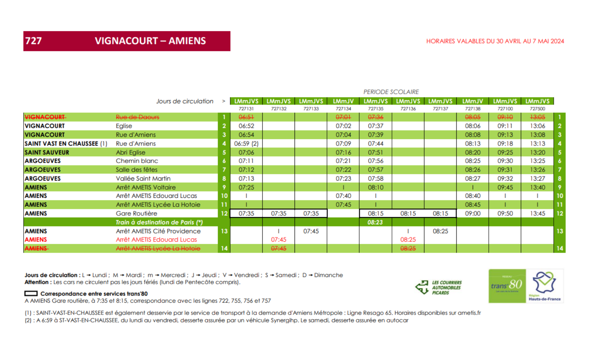

# Projet Trans'80

## Auteurs
- BRISACH Amaury
- CAUET Clément
- PADE Pierre

## Objectifs du projet
Le projet Trans'80 vise à combler le manque d'application client pour le suivi des trajets des bus du réseau Trans'80. Actuellement, les fiches horaires sont disponibles sur le site de Trans'80 sous forme de fichiers PDF, ce qui pose plusieurs problèmes :
- Manque de praticité
- Difficulté de lecture
- Informations statiques

Voici un exemple de fichier PDF de fiche horaire existant :

Les fiches horaires peuvent être consultées sur le site [Trans'80](https://trans80.hautsdefrance.fr/horaire/).

## Structure du projet

### API's
- Intégration des API de Ametis, SNCF, et Google Maps pour offrir des fonctionnalités avancées.

### Firebase
- Utilisation de Firebase pour la gestion des données en temps réel et l'authentification.

### Application d’extraction
- Développement d'une application pour extraire automatiquement les horaires des fichiers PDF.

### Application mobile
L'application mobile se compose de plusieurs modules :

## Promesses non tenues
Malgré les efforts déployés, certaines promesses n'ont pas pu être tenues :
- Intégration complète des API Ametis, SNCF, et Google Maps.
- Intégration cohérente entre l'application mobile, le serveur API, et l'application d'extraction.
- Automatisation de la récupération des horaires sur plusieurs PDF.

## Défis du projet
Le projet a rencontré plusieurs défis :
- L'ampleur du projet.
- L'accès difficile aux données des fiches horaires.
- La structuration des données.
- L'intégration de OAuth Google.
- L'intégration de Firebase.

## Futur du projet
Les prochaines étapes du projet incluent :
- L'intégration des API Ametis, SNCF, et Google Maps.
- Le suivi en temps réel des bus.
- Les notifications en cas de retard.
- Les notifications du taux de remplissage.
- La proposition d'une application de gestion des fiches horaires.